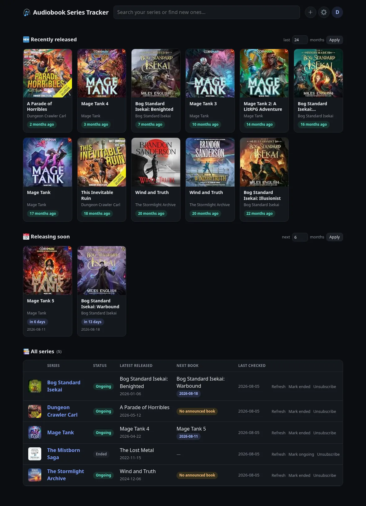
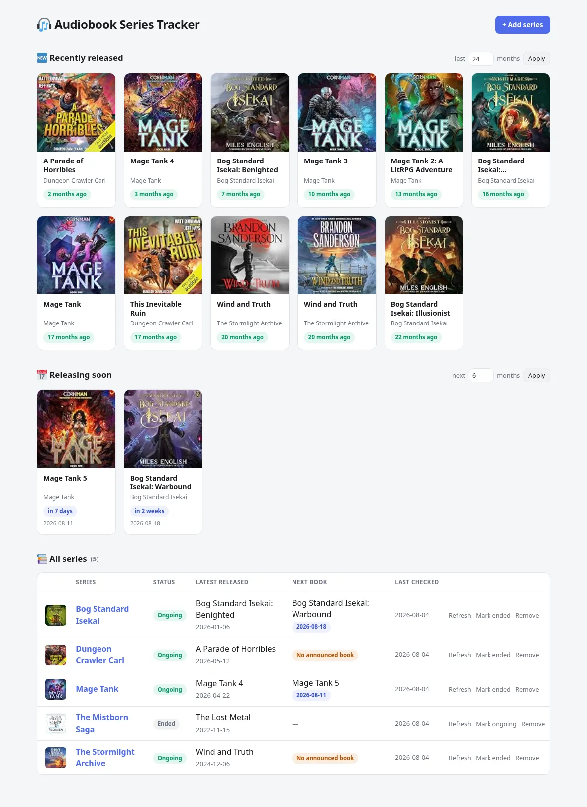
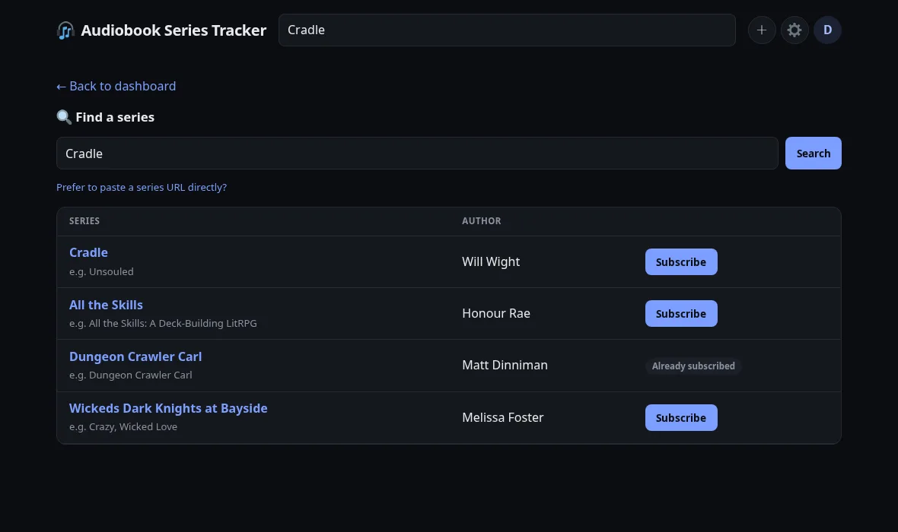

# 🎧 Audiobook Series Tracker

A self-hosted app for tracking audiobook series on Audible. Subscribe to the
series you listen to and it tells you when the next book is coming out — or
whether the series has wrapped up — without you having to go check manually.

Audible has no "notify me about the next book" feature and no public API for
this, so this app scrapes Audible's own public series and search pages (which
`robots.txt` explicitly permits crawling) for book titles, positions, release
dates, and cover art.

## Features

- **Multi-user accounts with an admin role** — each person logs in and
  subscribes to their own set of series. If two users subscribe to the same
  series, it's only scraped and stored once and shared between them;
  unsubscribing just removes your own subscription (the series sticks around
  until its last subscriber drops it). The first account ever created becomes
  admin and can create/promote/delete other users from `/admin/users`; after
  that, public signup closes — there's always at least one admin, so you
  can't lock yourself out.
- **A top bar with a unified search box** — type to instantly filter your own
  subscribed series on the dashboard, or hit enter to search Audible and
  subscribe to something new. Settings (dark/light/auto theme, notifications)
  and profile (change password, admin panel, log out) live in dropdown menus
  next to it, and the whole layout is responsive down to phone-sized screens.
- **Recently released** and **releasing soon** sections on the dashboard,
  each a rolling window (default 3 months, adjustable per-section) across
  every series you're subscribed to.
- **Full series list** showing status, latest release, and next known book.
- **Mark a series as ended** — Audible doesn't publish this anywhere, so it's
  a manual toggle.
- **Daily background refresh** of every subscribed series.
- **Installable as a PWA** on Android, iOS, and desktop, with **push
  notifications** when a subscribed series gets a new book or a previously
  TBD release date gets confirmed. On iOS, push only works after adding the
  app to your home screen (Share → Add to Home Screen) — that's an Apple
  platform restriction, not something this app can route around.
- **Dark mode by default**, with an automatic light-mode fallback based on
  your system preference.
- **Bulk import** — paste a list of titles (e.g. exported from Goodreads or
  StoryGraph), each line gets matched against Audible search, and you pick
  which matches to subscribe to before anything happens.
- **Mute a series** without unsubscribing — stops push notifications for it
  and drops it out of the "recently released"/"releasing soon" sections,
  while keeping it (and its history) in your full list for whenever you
  catch up.
- **Weekly digest option** — one push a week summarizing what's new across
  your subscriptions, for anyone who'd rather not get pinged per-book.
- **Calendar feed** — a personal `.ics` URL (in Settings) so upcoming release
  dates show up automatically in Google/Apple Calendar.
- **Export your subscriptions** to CSV any time.
- **Scraper health page for admins** (`/admin/health`) — since this whole app
  depends on scraping, this surfaces any series that have started failing to
  update instead of silently going stale.
- Single container, SQLite storage, no external services or API keys required.

## Screenshots

### Dashboard (dark mode)


### Dashboard (light mode)


### Search


## How it works

- **FastAPI** backend serving server-rendered Jinja2 templates (no JS build
  step, no frontend framework).
- **SQLite** for storage via SQLAlchemy.
- **APScheduler** runs an in-process daily job that re-scrapes every
  subscribed series and updates release dates, new books, and series names.
- Series discovery and lookup both scrape Audible's public HTML pages
  directly — `audible.com/series/...` for a series' full book list, and
  `audible.com/search?keywords=...` for the search page.
- Both of those requests are made by shelling out to `curl` rather than a
  Python HTTP client. This isn't stylistic — Audible's WAF blocks plain
  `httpx` requests (confirmed: identical requests via `curl` succeed, while
  `httpx` and even `curl_cffi` with full Chrome TLS-fingerprint impersonation
  both get a 503), but the real `curl` binary is unaffected. The Docker image
  installs `curl` for exactly this reason.

## Installation

### Requirements

- Docker and Docker Compose

### Quick start

```bash
git clone https://github.com/doubleu88/audiobook-series-tracker.git
cd audiobook-series-tracker
docker compose up -d --build
```

The app will be available at **http://localhost:8241**. Visit it and sign up
for the first account — this is the only time `/signup` is reachable. It
becomes the admin account, automatically takes ownership of any series
already in the database (relevant if you're migrating from an older
single-user version of this app), and can create further users from
`/admin/users` afterward.

Subscribed series and release data live in `./data/audiobooks.db` (SQLite),
which is mounted as a volume so it persists across container rebuilds. A
session-signing secret and a VAPID key pair (for push notifications) are
each generated on first run and stored alongside it at
`./data/.session_secret` and `./data/.vapid_private_key.pem` — back all three
up together, since losing the VAPID key invalidates every existing push
subscription and losing the session secret logs everyone out.

### Running without Docker

```bash
python -m venv .venv
source .venv/bin/activate
pip install -r requirements.txt
uvicorn app.main:app --host 0.0.0.0 --port 8000
```

### Logging

Logs (`docker compose logs -f`) are INFO level by default — set `LOG_LEVEL`
in `docker-compose.yml` to `DEBUG`, `WARNING`, `ERROR`, or `CRITICAL` to
change that permanently:

```yaml
services:
  audiobook-tracker:
    environment:
      - LOG_LEVEL=DEBUG
```

For a one-off debugging session without editing config or restarting the
container, an admin can flip debug logging on/off at runtime from
`/admin/health` instead — it reverts to the `LOG_LEVEL`-configured default
on the next restart.

## Contributing

See [CONTRIBUTING.md](CONTRIBUTING.md) for the PR process.

## Notes and limitations

- This relies on scraping Audible's public pages rather than an official API
  (none exists for this use case — see the note in `app/scraper.py`). If
  Audible changes their page layout, scraping may break until it's updated.
- "Series ended" is a manual flag you set yourself; there's no reliable public
  signal for this on Audible.
- Only the very first account can self-register; every account after that is
  created by an admin. That's a deliberate choice so this can be exposed to
  family/roommates without open signup, but it also means there's no
  self-service password reset — an admin has to delete and recreate an
  account if someone forgets their password.
- **Google/Apple Calendar subscriptions to the `.ics` feed can take a long
  time to show events, even right after subscribing.** Both apps poll
  subscribed-by-URL calendars on their own internal schedule — often
  12–48 hours — rather than fetching immediately when you add one, and
  removing/re-adding the same URL doesn't reliably force an early refetch.
  If you want to confirm the feed itself is fine (or just want events to
  show up right away), use a one-time **Import** instead of (or in addition
  to) the live subscription — in Google Calendar: Settings → Import & export
  → Import, pointing at the downloaded `.ics` file. That parses and loads
  the events immediately, independent of the subscription's polling
  schedule.
- Push notifications use the standard Web Push API (VAPID), the same
  mechanism as any other PWA — no third-party push service or account is
  involved. Each includes the relevant book's cover art as the notification
  icon where one is available. There are three triggers, and all of them
  require a series to have been scraped at least once already — the initial
  scrape when you first subscribe never fires one, so subscribing to a
  50-book backlog series doesn't flood you with notifications:
  - a new book (or preorder) shows up that wasn't there before
  - a book that had no release date gets one
  - a book's release date arrives (fires once, on the day, even if the date
    was announced long before)
